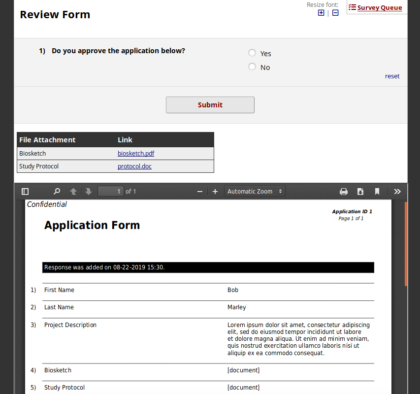

## Form Reviewer

This REDCap External Module is designed to facilitate the review of survey submissions, saved data entry forms, and file uploads.  It allows a project designer to embed elements of a previously saved form (or "source form") into a review form.  The reviewer can then examine the source form and record their comments without having to switch between REDCap forms or projects.

### Options

There are two elements from the source form that can be embedded into the review form:

1. An inline PDF of any data saved to the source form.
1. Download links for any files uploaded to the source form.

### Requirements

To configure the module, the REDCap user must have the following permissions:

* API Export token for the source project
  * The module uses the API Export token of the last user to change the configuration.  
* Project Design Rights in the review project

### Setup

1. Enable the module in the project which contains your review form.
1. Select a **Source project** in the dropdown.  This should be the project that contains the survey, data entry form or file uploads that you want to review.  It can be the current project or a different project as long as you have an API export token and access to the form in question.
1. Type the name of the **Source form**.  It should be typed according to the same syntax used in the data dictionary.  For example, a form titled "My First Instrument" should be typed in all lowercase with underscores like this: my_first_instrument
1. Select the **Review form** in the current project.
1. Select the **Record link** field in your review form that identifies the record number of the source form.  For example, if you are reviewing a set of applications stored in another project, you must have a field in your review form that stores the application id that you want to link to that particular review.
1. Similarly, if the source project is longitudinal, you must also specify an **Event link** field.  Note that this field should contain the unique event name and not the numeric event ID.  It should be typed just as it appears in REDCap's "Define My Events" page in the Project Setup tab. (Ex: It might be "baseline_arm_1" instead of simply "Baseline").
1. If you would like to **Embed a PDF** of the source form, check the box and select whether to place the PDF at the top or bottom of your review form.
1. If you would like to **Include download links** of files uploaded to the source form, check the box.  You also have the option of displaying the download links in a table or as a set of bullet points embedded in a field on your review form.
1. If you don't want to include all files uploaded to the source form, you can optionally choose a **Subset** and type the names of individual file upload fields to include.

### Limitations
* This module does not support repeating source forms.  The REDCap API for generating PDFs does not currently support a parameter for instance number.  So if you try to use this module on a repeating source form, you may not get the proper PDF or download links.  However, the review form *can* be a repeating instrument.
* File attachments are downloaded via the API to the REDCap temp directory and are periodically purged by the REDCap cron job, typically after 1 hour.  If the reviewer leaves the review form open for a long time, the download links can expire.
